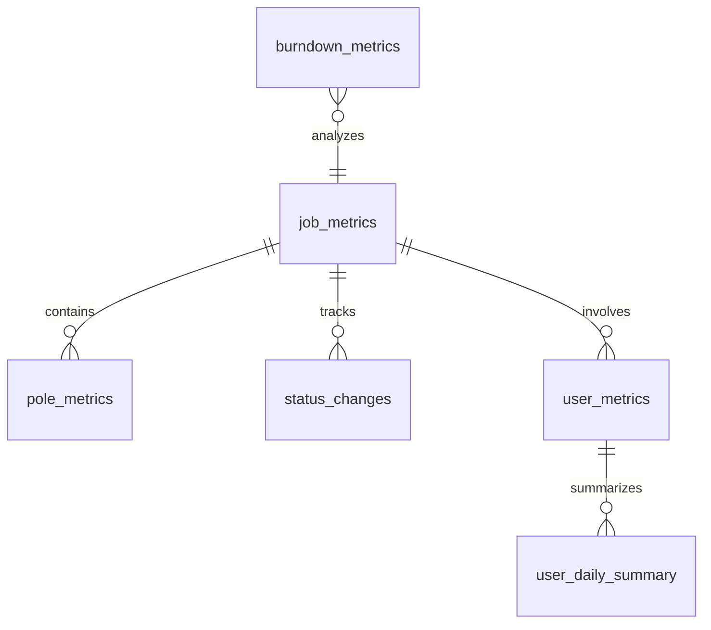

# Database Documentation

## Overview
The database tracks temporal metrics for jobs, poles, and user activities. It maintains historical records of status changes and supports weekly reporting functionality.

## Tables

### job_metrics
Primary table for tracking job status and progress over time.
- **Primary Key**: `id`
- **Unique Constraint**: `(job_id, timestamp)`
- **Key Fields**:
  - `job_id`: Job identifier
  - `status`: Current job status
  - `timestamp`: Record creation time
  - `utility`: Associated utility
  - `total_poles`: Total pole count
  - `completed_poles`: Completed pole count

### pole_metrics
Tracks individual pole status and completion.
- **Primary Key**: `id`
- **Unique Constraint**: `(job_id, node_id, timestamp)`
- **Key Fields**:
  - `job_id`: Associated job
  - `node_id`: Pole identifier
  - `field_completed`: Field completion status
  - `back_office_completed`: Back office completion status
  - `timestamp`: Record creation time

### status_changes
Logs status transitions for jobs.
- **Primary Key**: `id`
- **Unique Constraint**: `(job_id, changed_at)`
- **Key Fields**:
  - `job_id`: Job identifier
  - `previous_status`: Prior status
  - `new_status`: New status
  - `changed_at`: Change timestamp
  - `duration_hours`: Time in previous status

### user_metrics
Tracks user productivity and activities.
- **Primary Key**: `id`
- **Key Fields**:
  - `user_id`: User identifier
  - `job_id`: Associated job
  - `activity_type`: Type of work performed
  - `poles_completed`: Number of poles completed
  - `timestamp`: Record creation time

### user_daily_summary
Daily rollup of user activities.
- **Primary Key**: `id`
- **Unique Constraint**: `(user_id, date, role)`
- **Key Fields**:
  - `user_id`: User identifier
  - `date`: Summary date
  - `total_poles_completed`: Daily pole completion count
  - `utilities_worked`: Array of utilities worked on
  - `jobs_worked`: Array of jobs worked on

### burndown_metrics
Project progress and resource tracking.
- **Primary Key**: `id`
- **Key Fields**:
  - `utility`: Associated utility
  - `date`: Record date
  - `total_poles`: Total pole count
  - `completed_poles`: Completed pole count
  - `run_rate`: Completion rate
  - `estimated_completion_date`: Projected completion date

## Relationships

## Weekly Reporting Data Flow
1. `job_metrics` provides job status and progress
2. `pole_metrics` provides detailed completion data
3. `user_metrics` and `user_daily_summary` provide productivity metrics
4. `status_changes` provides temporal analysis
5. `burndown_metrics` provides project progress analysis

## Testing Weekly Reporter
To test the weekly reporter functionality:

1. **Data Prerequisites**:
   - Multiple jobs with different statuses
   - Pole completion records
   - User activity records
   - Status change history

2. **Test Scenarios**:
   - Status change timing accuracy
   - User productivity calculations
   - Burndown rate calculations
   - Weekly summary aggregations

3. **Verification Points**:
   - Status change durations
   - User completion counts
   - Project progress metrics
   - Weekly report data accuracy 